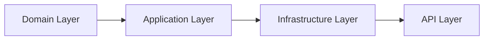

# Architecture Overview

This document describes the Clean Architecture structure of CleanTaskBoard and how authentication, authorization, and board membership fit into the system.



- **Domain**: Entities, enums, core business rules
- **Application**: CQRS, MediatR handlers, validation, authorization services
- **Infrastructure**: EF Core, PostgreSQL, repositories, security (JWT, hashing)
- **API**: Minimal API endpoints, DI wiring, authentication middleware, exception handling

---

## Domain Layer

The Domain layer contains the core entities and business concepts:

- `Board`
- `Column`
- `TaskItem`
- `Subtask`
- `User`
- `BoardMembership`
- `BoardRole` (Owner, Member, Viewer)
- `TaskPriority`

The board membership model is:

- Each `Board` has a single `OwnerUserId`.
- Additional users can be attached to the board via `BoardMembership` with a `Role`.
- `BoardRole` controls what the user can do on the board and its children (columns, tasks, subtasks).

See `docs/diagrams/entities.md` for the full class diagram.

---

## Application Layer

The Application layer coordinates use-cases via CQRS + MediatR and contains:

- Commands & Queries for:
  - Boards, Columns, Tasks, Subtasks
  - Authentication (Register/Login)
  - Board membership management
- Interfaces:
  - `IBoardRepository`, `IColumnRepository`, `ITaskItemRepository`, `ISubtaskRepository`
  - `IUserRepository`, `IBoardMembershipRepository`
  - `IJwtTokenGenerator`, `IPasswordHasher`
  - `IBoardAccessService`

### IBoardAccessService

All role-based authorization rules are centralized in `IBoardAccessService` and its implementation.

Examples:

- `EnsureCanReadBoard(boardId, userId, ct)`
- `EnsureCanEditBoard(boardId, userId, ct)`
- `EnsureCanManageMembership(boardId, userId, ct)`
- `EnsureCanReadColumn(columnId, userId, ct)`
- `EnsureCanEditColumn(columnId, userId, ct)`
- `EnsureCanEditColumnsForBoard(boardId, userId, ct)`
- `EnsureCanReadTask(taskId, userId, ct)`
- `EnsureCanEditTask(taskId, userId, ct)`
- `EnsureCanEditTasksForColumn(columnId, userId, ct)`
- `EnsureCanReadSubtask(subtaskId, userId, ct)`
- `EnsureCanEditSubtask(subtaskId, userId, ct)`
- `EnsureCanEditSubtasksForTask(taskId, userId, ct)`

Handlers call the access service **before** touching repositories, ensuring that:

- Non-members see `404`/`403` instead of leaking board existence.
- Owner/Member/Viewer semantics are enforced consistently.

---

## Infrastructure Layer

The Infrastructure layer contains:

- `AppDbContext` with DbSets:
  - `Boards`, `Columns`, `TaskItems`, `Subtasks`
  - `Users`, `BoardMemberships`
- Fluent configuration for all entities and relationships.
- Repository implementations using EF Core:
  - `BoardRepository`
  - `ColumnRepository`
  - `TaskItemRepository`
  - `SubtaskRepository`
  - `UserRepository`
  - `BoardMembershipRepository`
- Security components:
  - `JwtTokenGenerator` implementing `IJwtTokenGenerator`
  - `PasswordHasher` implementing `IPasswordHasher`
- DI registration via `CleanTaskBoard.Infrastructure.DependencyInjection`.

PostgreSQL is used as the backing database, configured via `appsettings.json` and `docker-compose.yml`.

---

## API Layer

The API layer is a .NET Minimal API project (`CleanTaskBoard.Api`) that wires:

- Dependency Injection for all layers
- JWT Bearer authentication
- Global exception handling (ProblemDetails-like JSON)
- Endpoint mappings for all features

### Main Endpoint Groups

- `/auth`
  - `POST /auth/register`
  - `POST /auth/login`
- `/boards`
  - `POST /boards`
  - `GET /boards`
  - `GET /boards/{boardId}`
  - `GET /boards/{boardId}/members`
  - `POST /boards/{boardId}/members`
  - `PUT /boards/{boardId}/members/{memberUserId}`
  - `DELETE /boards/{boardId}/members/{memberUserId}`
- `/boards/{boardId}/columns`
  - `POST /boards/{boardId}/columns`
  - `GET /boards/{boardId}/columns`
- `/columns/{columnId}`
  - `GET /columns/{columnId}`
  - `DELETE /columns/{columnId}`
- `/columns/{columnId}/tasks`
  - `POST /columns/{columnId}/tasks`
  - `GET /columns/{{columnId}}/tasks`
- `/tasks/{taskId}`
  - `GET /tasks/{taskId}`
  - `PUT /tasks/{taskId}`
  - `DELETE /tasks/{taskId}`
  - `PATCH /tasks/{taskId}/move`
  - `PATCH /tasks/{taskId}/reorder`
  - `PATCH /tasks/{taskId}/complete`
- `/tasks/{taskId}/subtasks`
  - `POST /tasks/{taskId}/subtasks`
  - `GET /tasks/{taskId}/subtasks`
- `/subtasks/{subtaskId}`
  - `GET /subtasks/{subtaskId}`
  - `PATCH /subtasks/{subtaskId}/complete`
  - `PATCH /subtasks/{subtaskId}/reorder`
  - `DELETE /subtasks/{subtaskId}`

All protected endpoints require a valid JWT token in the `Authorization` header:

```http
Authorization: Bearer {{accessToken}}
```

---

## CQRS Flow

The CQRS flow is the same for all features (including auth and membership):

1. Client calls HTTP endpoint.
2. API constructs a Command/Query and sends it via MediatR.
3. Handler executes business logic, calls `IBoardAccessService` for authorization, then repositories.
4. Result is mapped to response DTO and returned as JSON.

See `docs/diagrams/cqrs-flow.md` for the sequence diagram.
