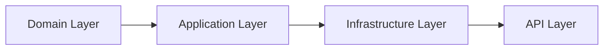

# Architecture Overview

This document describes the Clean Architecture structure of CleanTaskBoard.

- **Domain**: Entities, enums, core logic
- **Application**: CQRS, MediatR handlers, interfaces
- **Infrastructure**: EF Core, PostgreSQL, repositories
- **API**: Minimal API endpoints, DI wiring
