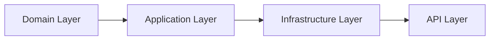

# Architecture Overview 

This document describes the Clean Architecture structure of CleanTaskBoard.

- **Domain**: Entities, enums, core logic, `User` aggregate for authentication.
- **Application**: CQRS, MediatR handlers, interfaces, authentication commands (`RegisterUser`, `Login`).
- **Infrastructure**: EF Core, PostgreSQL, repositories, security services (`PasswordHasher`, `JwtTokenGenerator`).
- **API**: Minimal API endpoints, DI wiring, OpenAPI, JWT Authentication & Authorization middleware.
