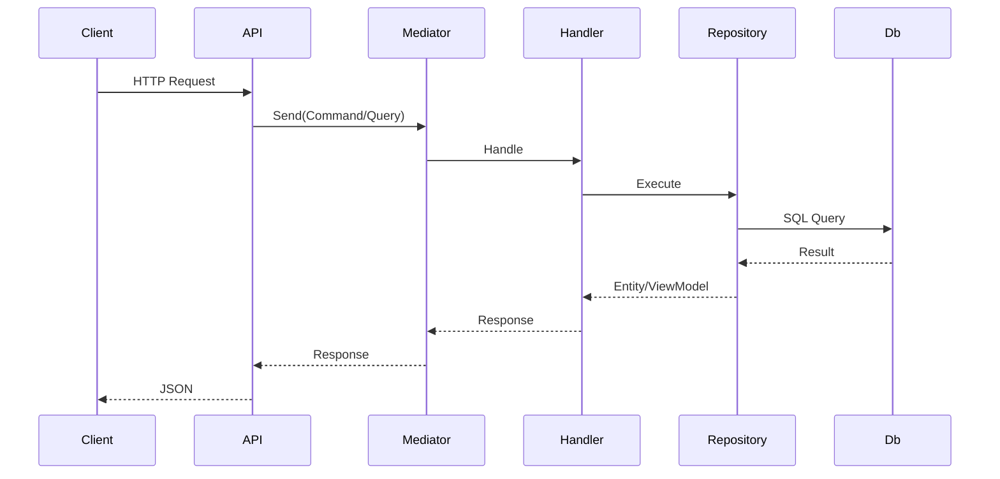

# CQRS Flow Diagram

```mermaid
sequenceDiagram
    participant Client
    participant API
    participant Mediator
    participant Handler
    participant Repository
    participant Db

    Client->>API: HTTP Request
    API->>Mediator: Send(Command/Query)
    Mediator->>Handler: Handle
    Handler->>Repository: Execute
    Repository->>Db: SQL Query
    Db-->>Repository: Result
    Repository-->>Handler: Entity/ViewModel
    Handler-->>Mediator: Response
    Mediator-->>API: Response
    API-->>Client: JSON
```
