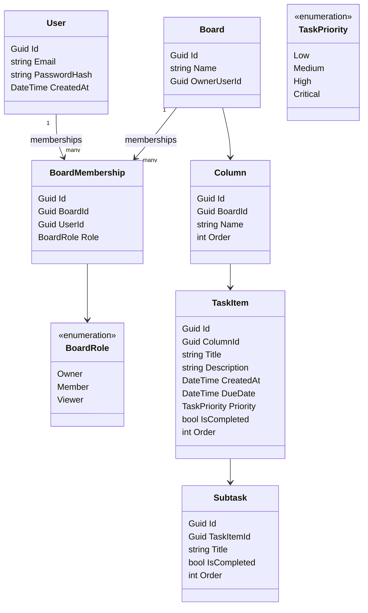

# Entity Diagram

```mermaid
classDiagram
    class User {
        Guid Id
        string Email
        string PasswordHash
        DateTime CreatedAt
    }

    class Board {
        Guid Id
        string Name
        Guid OwnerUserId
    }

    class BoardMembership {
        Guid Id
        Guid BoardId
        Guid UserId
        BoardRole Role
    }

    class BoardRole {
        <<enumeration>>
        Owner
        Member
        Viewer
    }

    class Column {
        Guid Id
        Guid BoardId
        string Name
        int Order
    }

    class TaskItem {
        Guid Id
        Guid ColumnId
        string Title
        string Description
        DateTime CreatedAt
        DateTime DueDate
        TaskPriority Priority
        bool IsCompleted
        int Order
    }

    class TaskPriority {
        <<enumeration>>
        Low
        Medium
        High
        Critical
    }

    class Subtask {
        Guid Id
        Guid TaskItemId
        string Title
        bool IsCompleted
        int Order
    }

    User "1" --> "many" BoardMembership : memberships
    Board "1" --> "many" BoardMembership : memberships
    BoardMembership --> BoardRole

    Board --> Column
    Column --> TaskItem
    TaskItem --> Subtask
```
