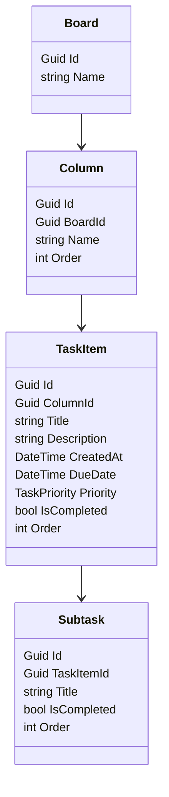

# Entity Diagram

```mermaid
classDiagram
    class Board {
        Guid Id
        string Name
    }

    class Column {
        Guid Id
        Guid BoardId
        string Name
        int Order
    }

    class TaskItem {
        Guid Id
        Guid ColumnId
        string Title
        string Description
        DateTime CreatedAt
        DateTime DueDate
        TaskPriority Priority
        bool IsCompleted
        int Order
    }

    class Subtask {
        Guid Id
        Guid TaskItemId
        string Title
        bool IsCompleted
        int Order
    }

    Board --> Column
    Column --> TaskItem
    TaskItem --> Subtask
```
