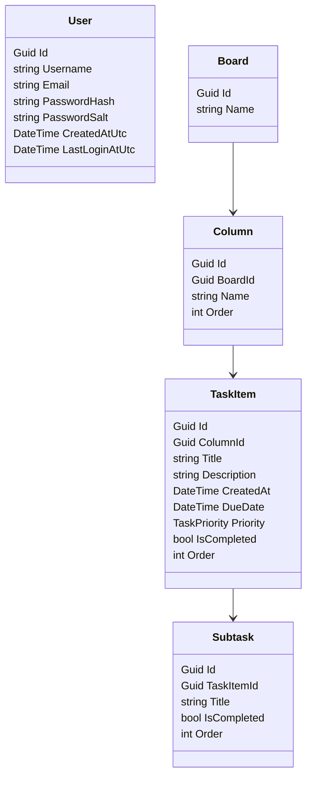

# Entity Diagram

```mermaid
classDiagram
    class User {
        Guid Id
        string Username
        string Email
        string PasswordHash
        string PasswordSalt
        DateTime CreatedAtUtc
        DateTime LastLoginAtUtc
    }

    class Board {
        Guid Id
        string Name
        %% OwnerUserId will be introduced in the next milestone
    }

    class Column {
        Guid Id
        Guid BoardId
        string Name
        int Order
    }

    class TaskItem {
        Guid Id
        Guid ColumnId
        string Title
        string Description
        DateTime CreatedAt
        DateTime DueDate
        TaskPriority Priority
        bool IsCompleted
        int Order
    }

    class Subtask {
        Guid Id
        Guid TaskItemId
        string Title
        bool IsCompleted
        int Order
    }

    Board --> Column
    Column --> TaskItem
    TaskItem --> Subtask
```

> Note: The relationship between `User` and `Board` (ownership / membership) will be modelled in a separate step, as part of the multi-user and collaboration features.
