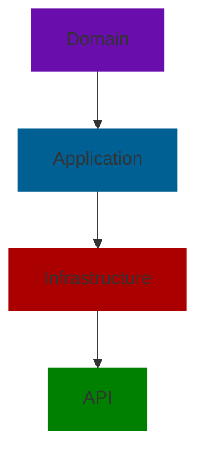

# Layer Diagram

- **Domain**: core entities, value objects, enums (Boards, Columns, Tasks, Subtasks, Users).
- **Application**: CQRS handlers, use-cases, interfaces, authentication commands.
- **Infrastructure**: persistence (EF Core, PostgreSQL), repositories, security (hashing/JWT).
- **API**: minimal API endpoints, dependency injection wiring, OpenAPI, JWT middleware.
